# Ykuatia — El sistema de cobro que tu junta necesita

**Menos planillas. Menos dudas. Más agua bien administrada.**

Ykuatia es la plataforma pensada para **juntas de saneamiento** de Paraguay: cobrar el agua, emitir boletas, controlar la caja y saber quién debe — sin depender de un técnico cada vez que cierra el mes.

Hecho para presidente, tesorero y cajero. Simple de usar. Listo para imprimir.

---

## ¿Por qué Ykuatia?

| Problema de siempre | Con Ykuatia |
|---------------------|-------------|
| Planillas Excel que nadie entiende | Un solo sistema para clientes, deudas y cobros |
| “¿Cuánto se recaudó hoy?” | Caja y cierres claros, con historial |
| Boletas hechas a mano o en Word | PDF listo para imprimir (incluso varias por hoja) |
| Morosos perdidos en papeles | Solo deuda **vencida**, con niveles claros |
| Una sola persona “que sabe” | Roles: presidente, tesorero, cajero |

---

## La oficina, de un vistazo

### Entrá seguro

Cada usuario con su rol. Sin compartir la misma clave.

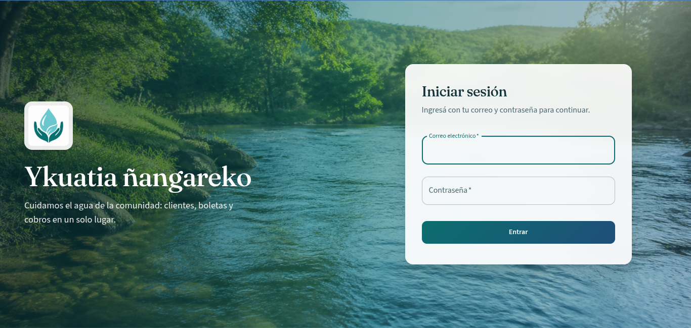

### Todo lo que la comisión necesita

Cobranza, caja, clientes y reportes a un clic.

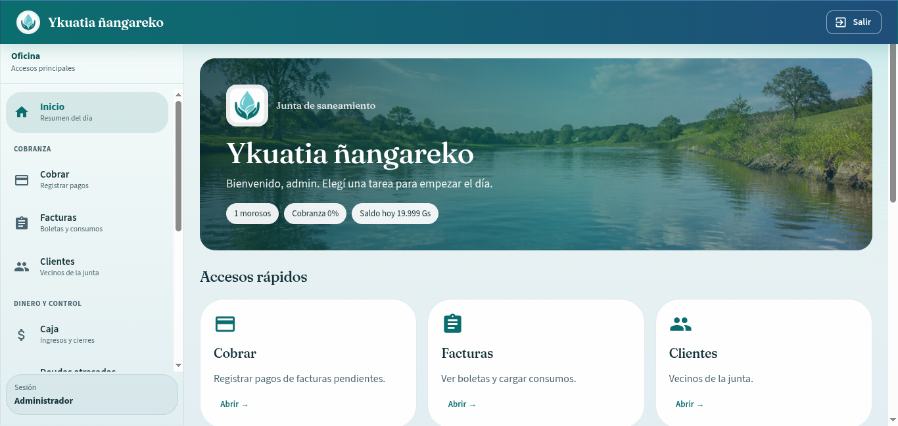

---

## Cobrá en segundos

Buscá al vecino, elegí la factura, cobrá total o parcial. El recibo se genera al instante.

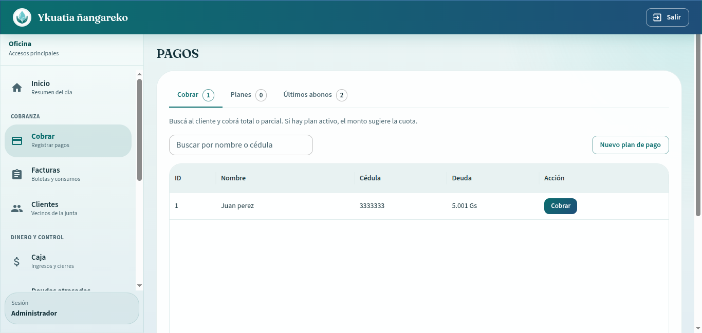

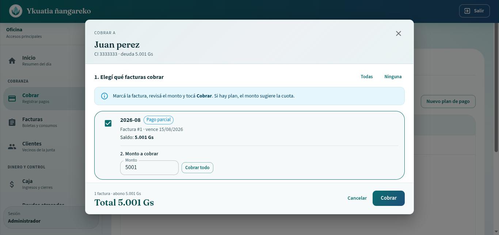

¿No puede pagar todo? Armá un **plan en cuotas**. Cada abono avanza solo — y si hubo un error, podés revertir.

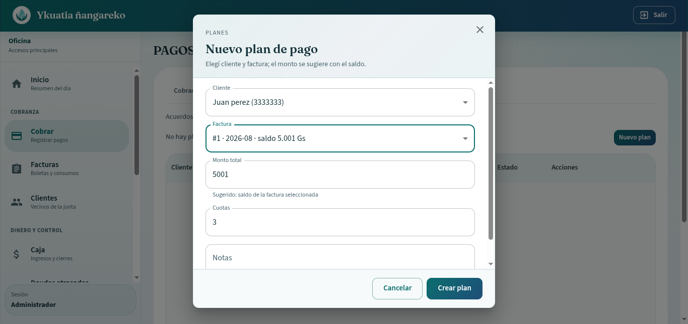

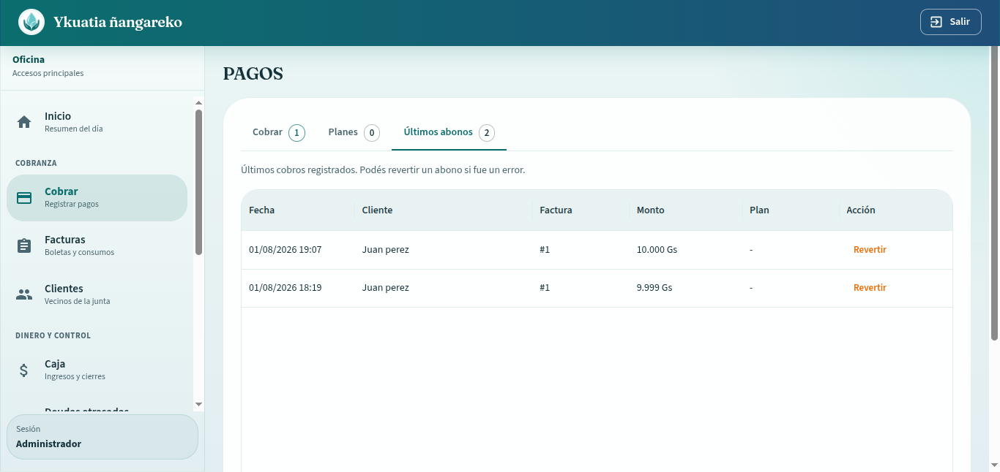

---

## Boletas que ahorran papel

Plantilla **Básica**: 2 o 4 boletas en una hoja A4 u oficio. Ideal para juntas chicas que imprimen y cortan.

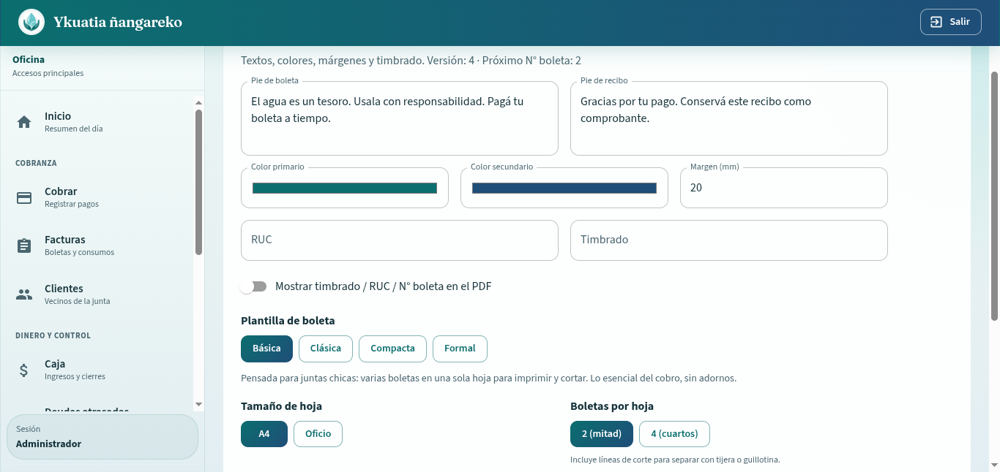

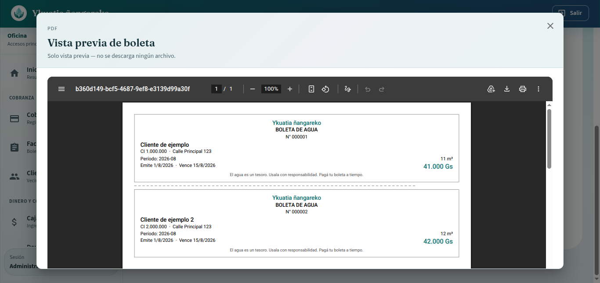

---

## Clientes y mapa

Cada socio geolocalizado. Encontrá la vivienda, mirá la deuda, organizá el trabajo de la comisión.

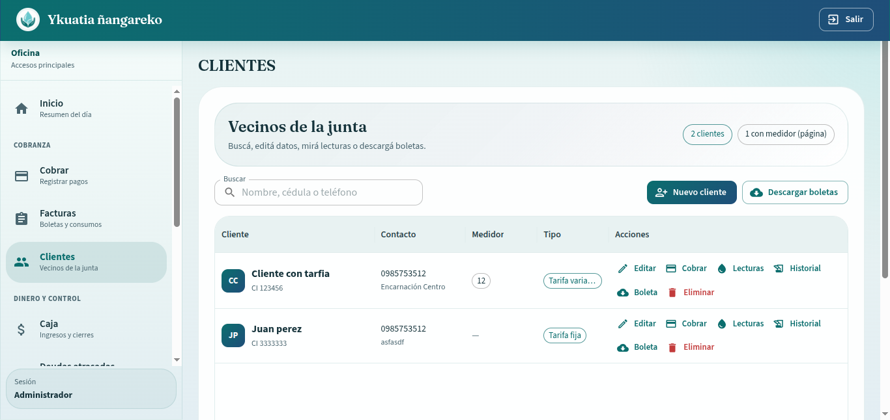

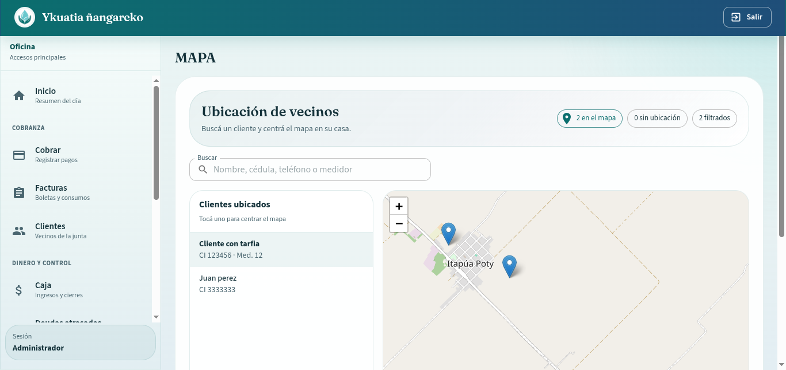

---

## Caja que cierra el día

Ingresos, egresos y cierres. El tesorero deja de dudar de los números.

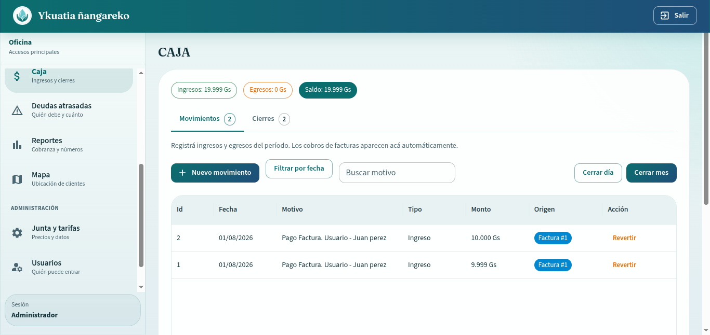

---

## Morosos con criterio

Solo aparecen clientes con facturas **ya vencidas**. Tener deuda del mes todavía dentro del plazo no cuenta como mora. Niveles: Reciente, Atención, Grave y Crítico.

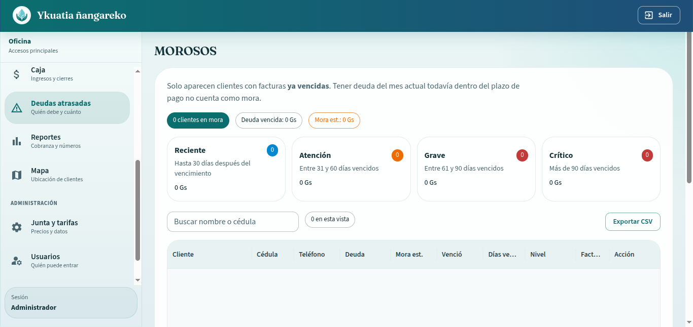

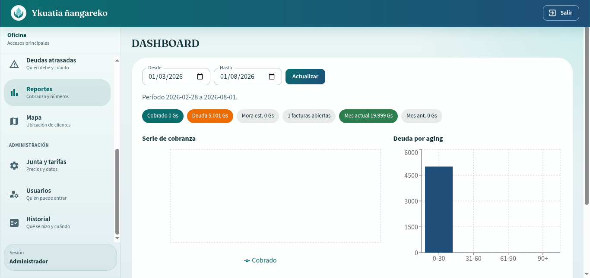

---

## Qué incluye el producto

### Cobranza
- Cobro total o parcial
- Planes de pago en cuotas
- Recibo PDF al cobrar
- Reverso de abonos por error

### Facturación
- Emisión mensual (automática o manual)
- Tarifas fijas / variables
- Mora y días de gracia configurables
- Boletas personalizables (clásica, compacta, formal o **básica multi-hoja**)

### Dinero y control
- Caja con ingresos y egresos
- Cierres exportables
- Auditoría de acciones sensibles
- Morosos por fecha de vencimiento

### Administración
- Usuarios y roles de oficina
- Datos de la junta (nombre, logo, pie de boleta)
- Backup desde el sistema

---

## Para quién es

- **Juntas pequeñas y medianas** que hoy trabajan con cuaderno o Excel  
- Comisiones que quieren **imprimir barato** (varias boletas por hoja)  
- Equipos con roles claros: quien cobra no necesita ver toda la configuración  

---

## Frases listas para usar (landing / redes)

- *“Cobrá el agua como se cobra en serio: con recibo, historial y caja cuadrada.”*  
- *“Dejá el Excel. Llevá la junta en orden.”*  
- *“Boletas listas para la impresora de la comisión — hasta 4 por hoja.”*  
- *“Hecho para Paraguay. Hecho para tu junta.”*

---

## Demo local (equipo técnico)

```bash
cp .env.example .env
# VITE_BASE_URL → URL del backend (ej. http://localhost:3000)

npm install
npm run dev
```

Credenciales de demo (tras seed del backend): ver README del Back-End (`admin@ykuatia.local`).

Stack: React · Vite · MUI · React Router · Redux Toolkit · Leaflet.

---

## Siguiente paso

¿Querés mostrarlo a una junta o a una comisión?

1. Compartí este README o un PDF con estas capturas  
2. Agendá una demo de 15 minutos: login → cobrar → imprimir boleta básica  

---

*Ykuatia — cuidamos el agua de la comunidad, y también los números de la comisión.*
